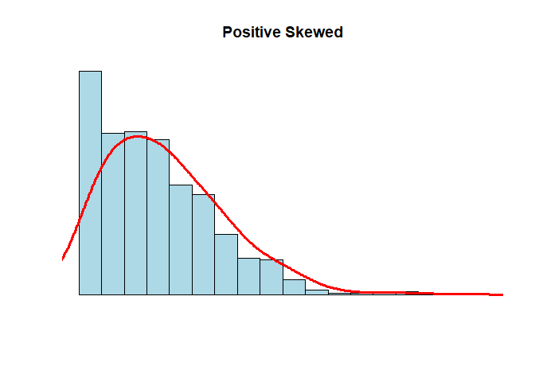
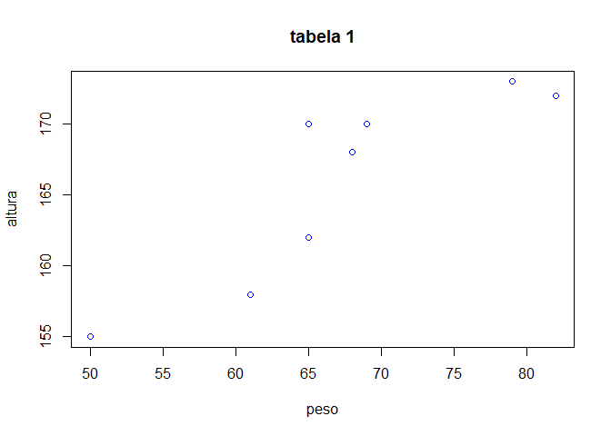

Atividade Avaliativa 01
================
Maiara Jesus Souza </br>
Estatística 2021.1

``` r
library(tidyverse)
```

    ## -- Attaching packages --------------------------------------- tidyverse 1.3.1 --

    ## v ggplot2 3.3.5     v purrr   0.3.4
    ## v tibble  3.1.6     v dplyr   1.0.7
    ## v tidyr   1.1.4     v stringr 1.4.0
    ## v readr   2.1.1     v forcats 0.5.1

    ## -- Conflicts ------------------------------------------ tidyverse_conflicts() --
    ## x dplyr::filter() masks stats::filter()
    ## x dplyr::lag()    masks stats::lag()

``` r
frango_dieta <- read_csv("dados/brutos/frango_dieta.csv")
```

    ## Rows: 578 Columns: 4

    ## -- Column specification --------------------------------------------------------
    ## Delimiter: ","
    ## dbl (4): peso, tempo, frango, dieta

    ## 
    ## i Use `spec()` to retrieve the full column specification for this data.
    ## i Specify the column types or set `show_col_types = FALSE` to quiet this message.

``` r
dados_co2 <- read_csv("dados/brutos/dados_co2.csv")
```

    ## Rows: 39 Columns: 13

    ## -- Column specification --------------------------------------------------------
    ## Delimiter: ","
    ## dbl (13): ano, jan, fev, mar, abr, mai, jun, jul, ago, set, out, nov, dez

    ## 
    ## i Use `spec()` to retrieve the full column specification for this data.
    ## i Specify the column types or set `show_col_types = FALSE` to quiet this message.

``` r
tabela_1_4_ <- read_csv("tabela 1 (4).csv")
```

    ## Rows: 8 Columns: 3

    ## -- Column specification --------------------------------------------------------
    ## Delimiter: ","
    ## chr (1): Nome
    ## dbl (2): altura, peso

    ## 
    ## i Use `spec()` to retrieve the full column specification for this data.
    ## i Specify the column types or set `show_col_types = FALSE` to quiet this message.

------------------------------------------------------------------------

**Questão 01**

**(a)** O erro dele é que o mesmo considerou a mala mais pesada sendo a
que representa o valor do quartis superior e a análise que pelo boxplot
existem malas mais pesadas entre esse quartil e o limite superior
(29kg), onde está localizado 25% da amostra. Portanto, 23kg não
representa a mala mais pesada da distribuição.

**(b)** A mediana é representada pelo segundo quartil, assim, o seu
valor é de 17kg

**(c)** A distância interquartílica é a diferença entre o quartil
superior pelo quartil inferior, assim, a distância seria 23 - 10 = 13.

**(d)** A quantidade de malas presente entre 5kg e 10kg está no primeiro
quartil que corresponde a 25% do total da amostra, assim, corresponderia
a 25% de 240 malas, ou seja, 60 malas.

**Questão 02**

A soma de todas as médias dos 30 alunos, multiplicando 30 pela média
aritmética das notas, ou seja, 6.40 encontrando como resultado 192. Da
mesma forma, obtive a soma total das médias dos outros 50 alunos da
outra turma, multiplicando o total de alunos (50) por 5,20 tendo como
total 260. Feito isso, somei a soma total das médias das duas turma (192
+ 260 = 452) e dividi por 80 (total de alunos correspondentes as duas
turmas) (452/80) . Assim, obtive que a média aritmética dos 80 alunos é
(a) 5,65.

**Questão 03**

**(a)** Para criar o vetor, utilize o seguinte código.

``` r
X  <- c ( 68 , 70 , 72 , 58 , 90 , 110 , 68 , 70 , 72 , 80 , 80 , 67 , 90 , 94 , 100 , 80 , 75 , 79 , 84 , 90 )
```

**(b)** Média = 79,85; Primeiro quartil = 70,0; Mediana = 79,5; Quartil
Terceiro = 90; Desvio padrão = 12.78681 Para encontrar essa resposta,
utilizei os seguintes códigos.

``` r
mean ( X )
```

    ## [1] 79.85

``` r
quantile ( X )
```

    ##    0%   25%   50%   75%  100% 
    ##  58.0  70.0  79.5  90.0 110.0

``` r
median ( X )
```

    ## [1] 79.5

``` r
sd ( X )
```

    ## [1] 12.78681

**(c)** No histograma, é possível perceber uma certa assimetria entre os
valores, por isso que a mediana representa a melhor medida central do
conjunto de dados.

**Questão 04**

**(a)** Ao analisar o conjunto de dados foi possível identificar que
cada coluna representa uma variável (peso, tempo, frango, dieta), cada
linha apresentava sobre as variáveis e cada célula apresentava uma única
observação, logo, este dataset está organizado na forma tidy.

**(b)** Usando o código.

``` r
mean( frango_dieta$peso )
```

    ## [1] 121.8183

Encontrei que a média do peso dos fragos é 121.8183.

**(c)** Usando o código.

``` r
sd ( frango_dieta$peso )
```

    ## [1] 71.07196

Encontrei como desvio padrão o valor 71.07196

**(d)** A variável peso é quantitativa contínua. A variável tempo é
quantitativa discreta A variável é frango qualitativa nominal A variável
dieta é qualitativa nominal.

**Questão 5** Rodando o seguinte código.

``` r
N <- 1000
x <- rnbinom(N, 4, .5)
hist(
x,
xlim = c(min(x), max(x)),
probability = T,
nclass = max(x) - min(x) + 1,
col = 'lightblue', xlab = ' ', ylab = ' ', axes = F,
main = 'Positive Skewed'
)
lines(density(x, bw = 1), col = 'red', lwd = 3)
```

<!-- -->

Analisando esse gráfico, é possível perceber que a disposição dos
valores é assimétrica, logo, a mediana é a melhor medida central para
representar esses dados.

**Questao 06**

**(a)**

``` r
dados_co2 <- read_csv("dados/brutos/dados_co2.csv")
```

    ## Rows: 39 Columns: 13

    ## -- Column specification --------------------------------------------------------
    ## Delimiter: ","
    ## dbl (13): ano, jan, fev, mar, abr, mai, jun, jul, ago, set, out, nov, dez

    ## 
    ## i Use `spec()` to retrieve the full column specification for this data.
    ## i Specify the column types or set `show_col_types = FALSE` to quiet this message.

**(b)** Não está no formato tidy, pois, as colunas não representam
variáveis, nesse caso, acredito que deveria haver 3 colunas (ano, mês,
co2).

**(c)** Organize o conjunto de dados na forma organizada com o seguinte
código.

``` r
dados_co2 %>%                
  pivot_longer (
    ! ano ,              
     names_to  =  " ano " ,    
     values_to  =  " dez "   
  )
```

    ## # A tibble: 468 x 3
    ##      ano ` ano ` ` dez `
    ##    <dbl> <chr>     <dbl>
    ##  1  1959 jan        315.
    ##  2  1959 fev        316.
    ##  3  1959 mar        316.
    ##  4  1959 abr        318.
    ##  5  1959 mai        318.
    ##  6  1959 jun        318 
    ##  7  1959 jul        316.
    ##  8  1959 ago        315.
    ##  9  1959 set        314.
    ## 10  1959 out        313.
    ## # ... with 458 more rows

**(d)**

``` r
dados_co2 <- read_csv("dados/brutos/dados_co2.csv")
```

    ## Rows: 39 Columns: 13

    ## -- Column specification --------------------------------------------------------
    ## Delimiter: ","
    ## dbl (13): ano, jan, fev, mar, abr, mai, jun, jul, ago, set, out, nov, dez

    ## 
    ## i Use `spec()` to retrieve the full column specification for this data.
    ## i Specify the column types or set `show_col_types = FALSE` to quiet this message.

``` r
dados_co2 %>% View()
```

``` r
dados_co2_tidy <- dados_co2 %>% 
  pivot_longer(
    !ano, 
   names_to = "mes",
   values_to = "ppm"
  )
```

``` r
write_csv(dados_co2_tidy, "dados/tidy/dados_co2_tidy.csv")
```

**(e)** Ao passar dos anos a mídia esta subindo exponencialmente.

``` r
co2_tidy <- read_csv ("dados/brutos/dados_co2_tidy.csv")
```

    ## Rows: 468 Columns: 3

    ## -- Column specification --------------------------------------------------------
    ## Delimiter: ","
    ## chr (1): mes
    ## dbl (2): ano, ppm

    ## 
    ## i Use `spec()` to retrieve the full column specification for this data.
    ## i Specify the column types or set `show_col_types = FALSE` to quiet this message.

``` r
co2_tidy%>% glimpse ()
```

    ## Rows: 468
    ## Columns: 3
    ## $ ano <dbl> 1959, 1959, 1959, 1959, 1959, 1959, 1959, 1959, 1959, 1959, 1959, ~
    ## $ mes <chr> "jan", "fev", "mar", "abr", "mai", "jun", "jul", "ago", "set", "ou~
    ## $ ppm <dbl> 315.42, 316.31, 316.50, 317.56, 318.13, 318.00, 316.39, 314.65, 31~

``` r
#-------------------------------------------
co2_tidy %>% # conjunto de dados
group_by(ano) %>% # agrupa por ano
summarise(media = round(mean(ppm), 2)) %>% # calcula a média da variavel ppm em cada grupo
ggplot(aes(ano, media, group = 1)) + # cria o gráfico
geom_line(color = "blue", size = 1)
```

<!-- -->

``` r
#-------------------------------------------
```

**Questão 07**

**(a)** Criei um tibble da seguinte forma:

``` r
tabela_tibble  <- tribble (
   ~ nome ,        ~ altura , ~ peso ,
   " Ana " ,        155 ,      50 ,
   " Ludmilla " ,   158 ,      61 ,
   " Cristina " ,   162 ,      65 ,
   " Tereza " ,     168 ,      68 ,
   " Patrícia " ,   170 ,      69,
   " Mariana " ,    170 ,      65 ,
   " Ana Paula " ,  172 ,      82 ,
   " Dirce " ,      173 ,      79 
)
```

tabela_tibble \<- tribble ( \~ nome , \~ altura , \~ peso , ” Ana ” ,
155 , 50 , ” Ludmilla ” , 158 , 61 , ” Cristina ” , 162 , 65 , ” Tereza
” , 168 , 68 , ” Patrícia ” , 170 , 69, ” Mariana ” , 170 , 65 , ” Ana
Paula ” , 172 , 82 , ” Dirce ” , 173 , 79 )

**(b)** A variável nome é uma variável qualitativa nominal A variável
altura é uma variável quantitativa contínua A variável peso é uma
variável quantitativa contínua.

**(c)** Calculei a média, mediana e desvio padrão da altura e peso
usando os seguintes códigos.

``` r
mean ( tabela_tibble $ peso )
```

    ## [1] 67.375

``` r
median ( tabela_tibble $ peso )
```

    ## [1] 66.5

``` r
sd ( tabela_tibble $ peso )
```

    ## [1] 10.04188

``` r
mean ( tabela_tibble $ altura )
```

    ## [1] 166

``` r
median ( tabela_tibble $ altura )
```

    ## [1] 169

``` r
sd ( tabela_tibble $ altura )
```

    ## [1] 6.78233

Para a altura encontrei - média = 166 - mediana = 169 desvio padrão =
6,78233 Para o peso encontrei - média = 67,375 - mediana = 66,5 - desvio
padrão = 10,04188

**(d)** Execute o seguinte código

``` r
plot(tabela_1_4_$"peso", tabela_1_4_$"altura" , col = "blue", xlab = "peso", ylab = "altura", main = "tabela 1")
```

<!-- -->
Aparentemente, a relação observada é que, quanto maior o peso da pessoa,
maior é sua altura. Entretanto existe dois valores que distoam dessa
relação uma delas com o mesmo peso de 65kg porem maior do que a outra do
mesmo peso, e uma pesando acima de 80kg porém mais baixa do que uma
pessoa que pesa proximo a 80kg
